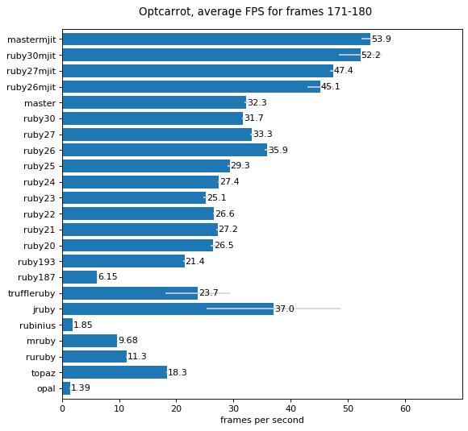
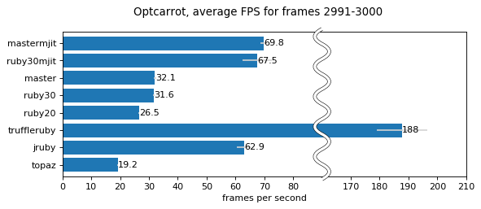

# Optcarrot: A NES Emulator for Ruby Benchmark

## Project Goals

This project aims to provide an "enjoyable" benchmark for Ruby implementation to drive ["Ruby3x3: Ruby 3 will be 3 times faster"][ruby3x3].

The specific target is a NES (Nintendo Entertainment System) emulator that works at *20 fps* in Ruby 2.0.  An original NES works at 60 fps.  If Ruby3x3 is succeeded, we can enjoy a NES game with Ruby!

NOTE: We do *not* aim to create a practical NES emulator.  There have been already many great emulators available.  We recommend you use another emulator if you just want to play a game.

## Basic usage

SDL2 is required.

    $ git clone http://github.com/mame/optcarrot.git
    $ cd optcarrot
    $ bin/optcarrot examples/Lan_Master.nes

|key   |button       |
|------|-------------|
|arrow |D-pad        |
|`Z`   |A button     |
|`X`   |B button     |
|space |Start button |
|return|Select button|

See [`doc/bonus.md`](doc/bonus.md) for advanced usage.

## Benchmark example

Here is FPS after 3 seconds in the game's clock.

Here is FPS after 50 seconds in the game's clock. (Only fast implementations are listed.)

See [`doc/benchmark.md`](doc/benchmark.md) for the measurement condition and some other charts.

See also [Ruby Releases Benchmarks](https://rubybench.org/ruby/ruby/releases?result_type=Optcarrot%20Lan_Master.nes) and [Ruby Commits Benchmarks](https://rubybench.org/ruby/ruby/commits?result_type=Optcarrot%20Lan_Master.nes&display_count=2000) for the continuous benchmark results.

You may also want to read [@eregon's great post](https://eregon.me/blog/2016/11/28/optcarrot.html) for TruffleRuby potential performance after warm-up.

## `benchmark/ips`

    $ ruby -v bin/optcarrot-bips

    ruby 2.6.3p62 (2019-04-16 revision 67580) [x86_64-darwin18]
    Warming up --------------------------------------
               optcarrot     4.000  i/100ms
               optcarrot     4.000  i/100ms
               optcarrot     4.000  i/100ms
    Calculating -------------------------------------
               optcarrot     45.360  (± 4.4%) i/s -    456.000  in  10.067316s
               optcarrot     45.590  (± 2.2%) i/s -    456.000  in  10.013507s
               optcarrot     44.034  (± 4.5%) i/s -    440.000  in  10.022025s

    truffleruby (Shopify) 20.0.0-dev-df4c0444, like ruby 2.6.2, GraalVM CE JVM [x86_64-darwin]
    Warming up --------------------------------------
              optcarrot    19.000  i/100ms
              optcarrot    27.000  i/100ms
              optcarrot    26.000  i/100ms
    Calculating -------------------------------------
              optcarrot    277.143  (± 1.8%) i/s -      2.782k in  10.041371s
              optcarrot    279.027  (± 1.1%) i/s -      2.808k in  10.064909s
              optcarrot    277.001  (± 2.2%) i/s -      2.782k in  10.048156s

Warmup and measurement time is currently pretty extreme - you may want to
experiment and reduce.

## Optimized mode

It may run faster with the option `--opt`.

    $ bin/optcarrot --opt examples/Lan_Master.nes

This option will generate an optimized (and super-dirty) Ruby code internally, and replace some bottleneck methods with them.  See [`doc/internal.md`](doc/internal.md) in detail.

## See also

* [Slide deck](http://www.slideshare.net/mametter/optcarrot-a-pureruby-nes-emulator) ([Tokyo RubyKaigi 11](http://regional.rubykaigi.org/tokyo11/en/))

## Acknowledgement

We appreciate all the people who devoted efforts to NES analysis.  If it had not been not for the [NESdev Wiki][nesdev-wiki], we could not create this program.  We also read the source code of Nestopia, NESICIDE, and others.  We used the test ROMs due to NESICIDE.

[ruby3x3]: https://www.youtube.com/watch?v=LE0g2TUsJ4U&t=3248
[nesdev-wiki]: http://wiki.nesdev.com/w/index.php/NES_reference_guide
